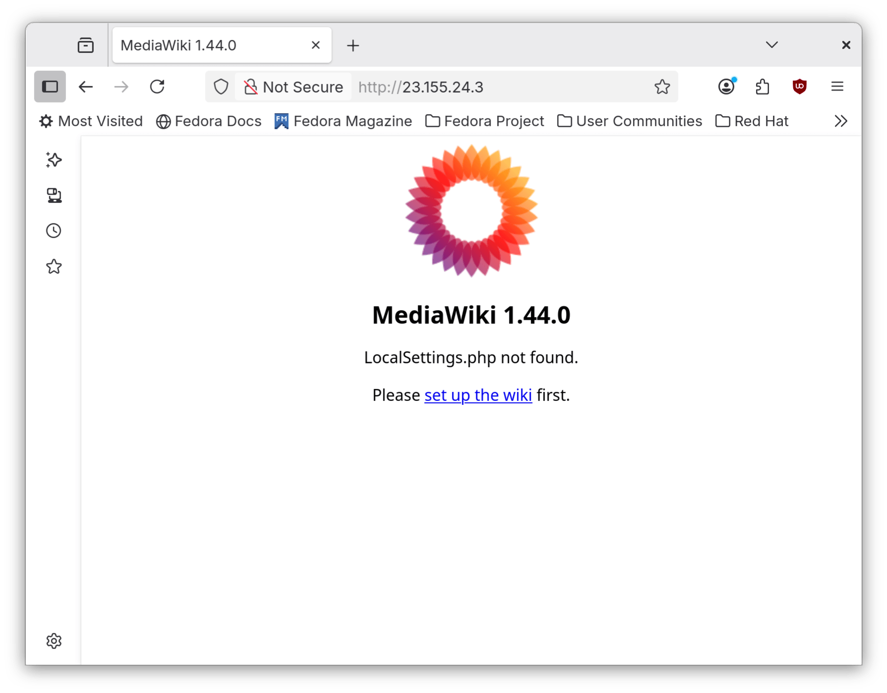
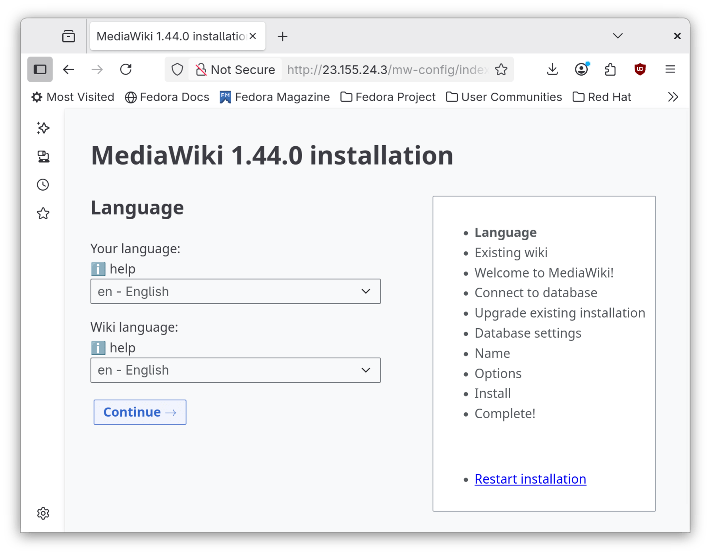
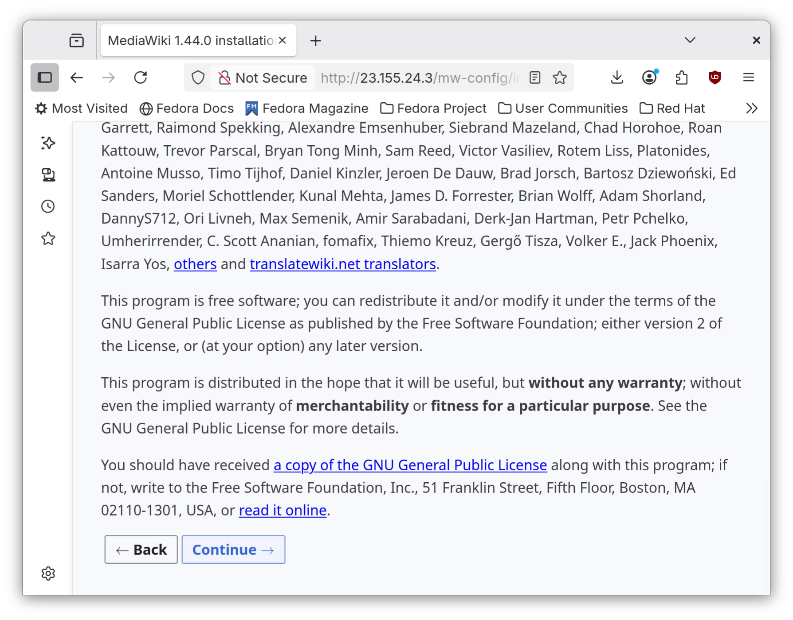
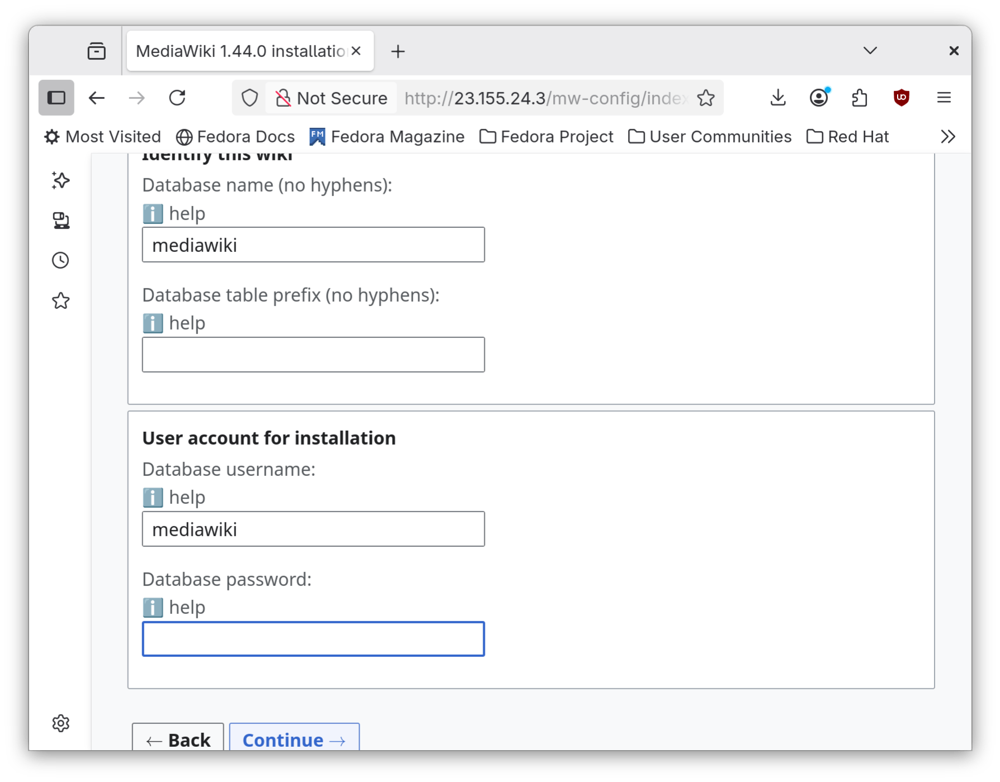
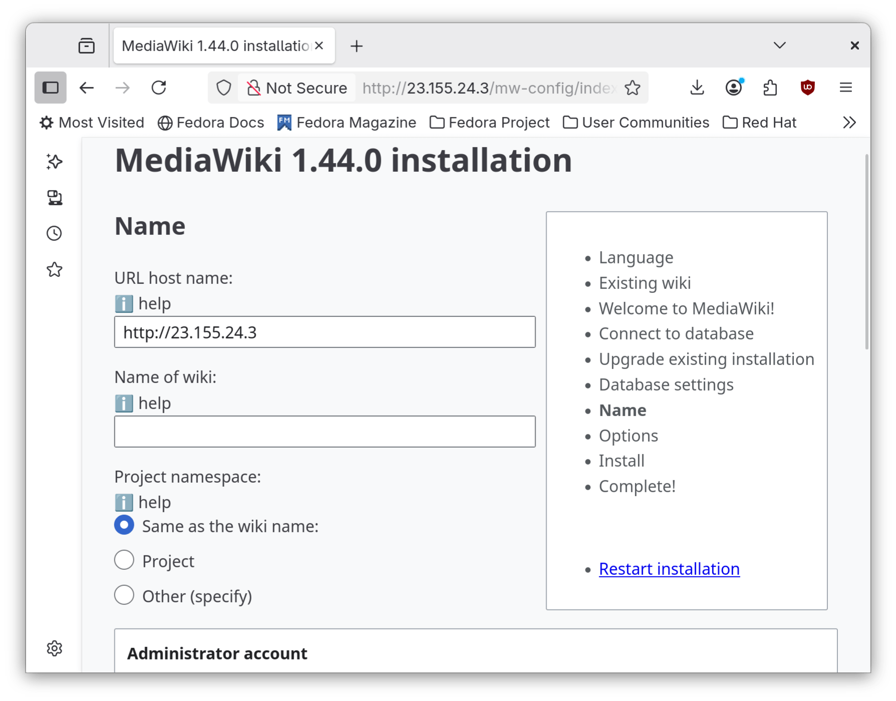
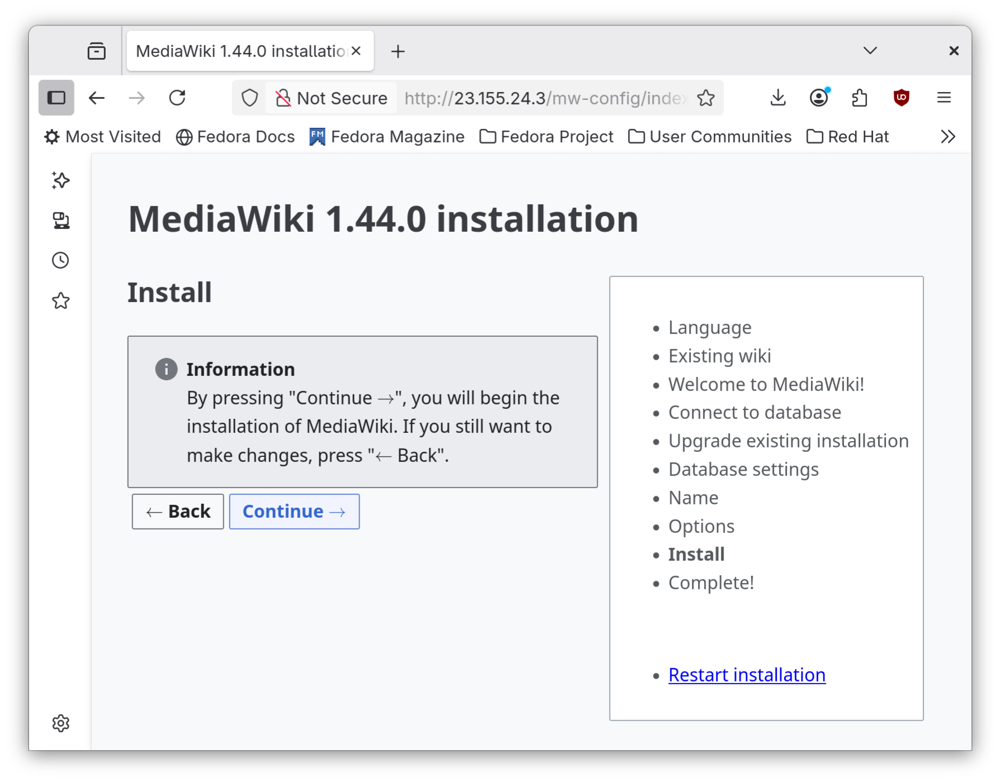
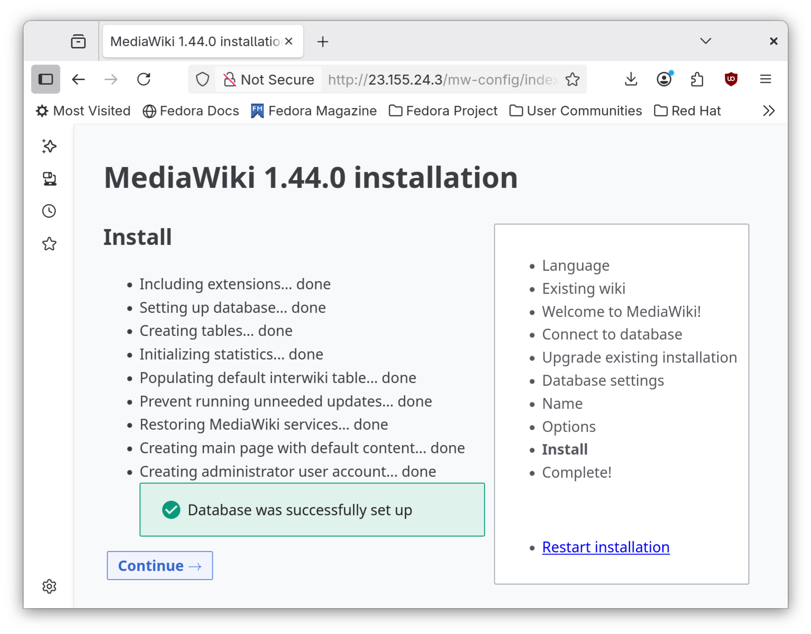
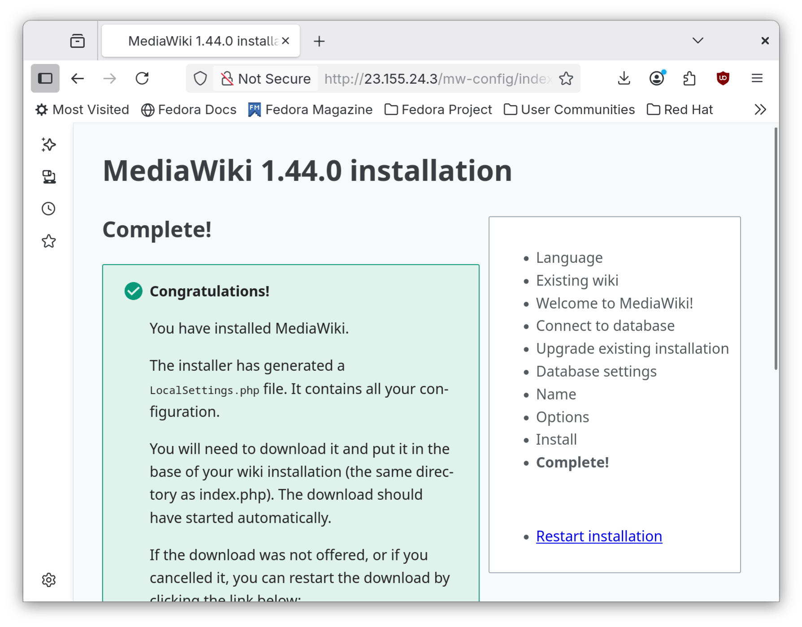
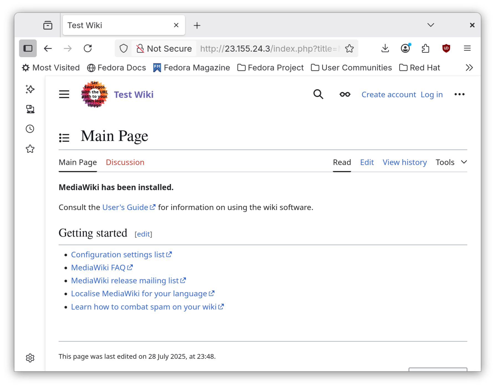

## Introduction

[MediaWiki](https://www.mediawiki.org/wiki/MediaWiki) is a popular open source Wiki software engine powering sites like Wikipedia, Fandom and wikiHow, among others.

## Prerequisites and assumptions

The following are the minimum requirements for using this procedure:

* The ability to run commands as the root user or use `sudo` to elevate privileges
* Familiarity with a command-line editor. The author is using `vi` or `vim` here, but substitute in your favorite editor

## Installing Apache

We will use Apache as the web server. First install Apache:

```bash
dnf -y install httpd
```

Next, open the corresponding firewall ports:

```bash
sudo firewall-cmd --permanent --zone=public --add-service=http
sudo firewall-cmd --permanent --zone=public --add-service=https
sudo firewall-cmd --reload
```

## Installing PHP

!!! note

    If you are running Rocky Linux 8.x or 9.x, substitute "8" or "9" next to the release in the Remi package install line. 

To install PHP, you need first to install the EPEL (Extra Packages for Enterprise Linux):

```bash
dnf -y install epel-release && dnf -y update
```

You will need the Remi repository. To install the Remi repository, run the following:

```bash
dnf install https://rpms.remirepo.net/enterprise/remi-release-10.rpm
```

Then install PHP and the required modules:

```bash
dnf install -y dnf install php84-php-fpm php84-php-intl php84-php-mbstring php84-php-apcu php84-php-curl php84-php-mysql php84-php-xml
```

Now enable PHP:

```bash
systemctl enable --now php84-php-fpm.service
```

## Installing MariaDB

Now, we are going to install MariaDB. Install it via `dnf`:

```bash
dnf install mariadb-server
```

Next enable the `systemd` service and run the setup wizard:

```bash
systemctl enable --now mariadb
mysql_secure_installation
```

When asked for the root password press `Enter`:

```bash
Enter current password for root (enter for none):
```

Say `n` to `unix_socket` authentication:

```bash
Switch to unix_socket authentication [Y/n] n
```

Say `Y` to changing the root password and enter the desired root password:

```bash
Change the root password? [Y/n] Y
New password: 
Re-enter new password: 
```

Remove the anonymous users and disallow remote `root` logins:

```bash
Remove anonymous users? [Y/n] Y
...
Disallow root login remotely? [Y/n] Y
```

Remove access to the test database and reload privilege tables:

```bash
Remove test database and access to it? [Y/n] Y
...
Reload privilege tables now? [Y/n] Y
```

Now we will login to MariaDB. Run:

```bash
mysql -u root -p
```

Enter the root password you created earlier.

When you are in the MariaDB console, create the database for MediaWiki:

```bash
MariaDB [(none)]> create database mediawiki;
```

Now create the MediaWiki user:

```bash
MariaDB [(none)]> create user 'mediawiki'@'localhost' identified by 'nchauhan11';
```

Grant privileges on the MediaWiki database:
```bash
grant all privileges on mediawiki.* to 'mediawiki'@'localhost';
```

Now flush the privileges:

```bash
MariaDB [(none)]> flush privileges;
```

## Installing MediaWiki

Go to the `/var/www/` directory and download MediaWiki:

```bash
cd /var/www/
wget https://releases.wikimedia.org/mediawiki/1.44/mediawiki-1.44.0.zip
```

Unzip and move MediaWiki:

```bash
unzip mediawiki-1.44.0.zip
mv mediawiki-1.44.0/* html/
```

Set the correct SELinux permissions:

```bash
chown -R apache:apache /var/www/html
semanage fcontext -a -t httpd_sys_rw_content_t "/var/www/html(/.*)?"
restorecon -Rv /var/www/html
```

Enable Apache:

```bash
systemctl enable --now httpd
```

Now open a browser to `http://your_ip` (Replace `your_ip` with your IP address):



Select your language and click **Continue**:



Check to see if the PHP configuration is correct, scroll down and click **Continue**:



Now, enter the database information as follows:

 * **Database host**: `localhost`

 * **Database name (no hyphens)**: `mediawiki` (or the database created in the **MariaDB** step)

 * **Database username:**: `mediawiki` (or the user created in the **MariaDB** step)

 * **Database password**: The password which was created in the **MariaDB** step



Click **Continue**:


In the **MediaWiki *version* installation** page, enter the following:

 * **URL host name**: The desired URL

 * **Name of wiki**: The desired Wiki name

 * **Administrator account**/**Your username**: The desired admin username

 * **Administrator account**/**Password (again)**: The desired admin password

 * **Administrator account**/**Email address**: The desired admin email address

Optionally, you can also select **Ask me more questions** to fine-tune the Wiki. For simplicity's sake, let us select **I'm bored already, just install the wiki** and click **Continue**:



Click **Continue** to install the Wiki:



MediaWiki will set up the databases. When it is done, click **Continue**:



Your browser will download a `LocalSettings.php` file. This will be uploaded to your server via `sftp`.

As an example, the author will use their Fedora 42 laptop to upload this file. To do so:

```bash
sftp root@your_ip
(Enter password)
cd /var/www/html
put LocalSettings.php 
```



Now click **enter your wiki**:



You now have a fresh MediaWiki installation.

## Conclusion

While MediaWiki is best known for powering Wikipedia, it is useful as a content management system where users need the ability to edit pages. For instance, MediaWiki is a good open source alternative to Microsoft's SharePoint.
